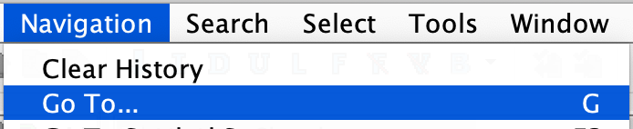

# Patch macOS app with Ghidra
##### Reminders

Area | Tip  
--|--
auto-analysis |  Select `Decompiler Parameter ID`
Merge Windows |  Drag the Titlebar of a Window into another
Seek address  |  (see below)




##### Export and Code Sign
After applying any patch, select `File` and `Export Program`. Do NOT select the `Export Tool` option.

Once exported, open `Terminal`:
```
chmod +x MyApp.bin

mv MyApp.bin /Applications/MyApp.App/Content/MacOS/MyApp

security find-identity -v -p codesigning

codesign --deep --force -s <mac Developer ID> MyApp.app

// RESULT -> MyApp.app: replacing existing signature
```

##### Entitlements
If Code-signing fails, check the `entitlements`:
```
jtool --ent MyApp.app/Contents/MacOS/MyApp

codesign -d --entitlements :- MyApp.app/Contents/MacOS/MyApp
```
You can list and clear them:
```
xattr -lr MyApp.app

xattr -cr MyApp.app
```
If you get these errors:
```
EXC_CRASH (Code Signature Invalid)
// check you Code Signed the .app, with the --deep flag

LSOpenURLsWithRole() failed with error -10810
// check file has execute permission

LSOpenURLsWithRole() failed with error -600
// check app was not open, with a debugger attached
```
##### Anti-Patching Detection
```
lldb MyApp.app

(lldb) run
Variant is NONAPPSTORE. Config is Release. Crash reporting (App Center) is enabled. Updating is enabled.
// I was still able to attach, when I removed all Entitlements to a Release build

Process ... exited with status = 173
// The anti-patching, Code Signing error
```
Now we need to `backtrace` the Exit:
```
lldb MyApp.app

(lldb) break set -n exit
(lldb) br del 1.2
(lldb) br list
Current breakpoints:
1: name = 'exit', locations = 3, resolved = 2, hit count = 7
  1.1: where = Foundation`+[NSThread exit], address = 0x00007fff332304be, resolved, hit count = 0
  1.2: where = Security`Security::CountingMutex::exit(), address = 0x00007fff3c4e01e2, unresolved, hit count = 6  Options: disabled
  1.3: where = libsystem_c.dylib`exit, address = 0x00007fff5cff667c, resolved, hit count = 1

 ** breakpoint fires **
 (lldb) frame info
 frame #0: 0x00007fff5cff667c libsystem_c.dylib` exit

(lldb) register read -f d

r11 = libsystem_c.dylib`exit
rdi = 173

(lldb) bt
* thread #2, queue = 'com.apple.root.default-qos', stop reason = breakpoint 1.3
  * frame #0: 0x00007fff5cff667c libsystem_c.dylib` exit
    frame #1: 0x00000001004a6c54 Sketch` ___lldb_unnamed_symbol21578$$Sketch  + 52
    frame #2: 0x00000001004a189b Sketch` ___lldb_unnamed_symbol21476$$Sketch  + 699
```


##### References
```
https://reverse.put.as/2011/01/15/reversing-the-exit173-from-the-mac-app-store/
https://duraki.github.io/posts/o/20200214-sketch.app-patch-in-ghidra.html
https://cardaci.xyz/blog/2018/02/12/a-macos-anti-debug-technique-using-ptrace/
http://www.cs.cmu.edu/afs/cs/user/lenzo/html/mac_errors.html
https://ghidra-sre.org/CheatSheet.html

```
