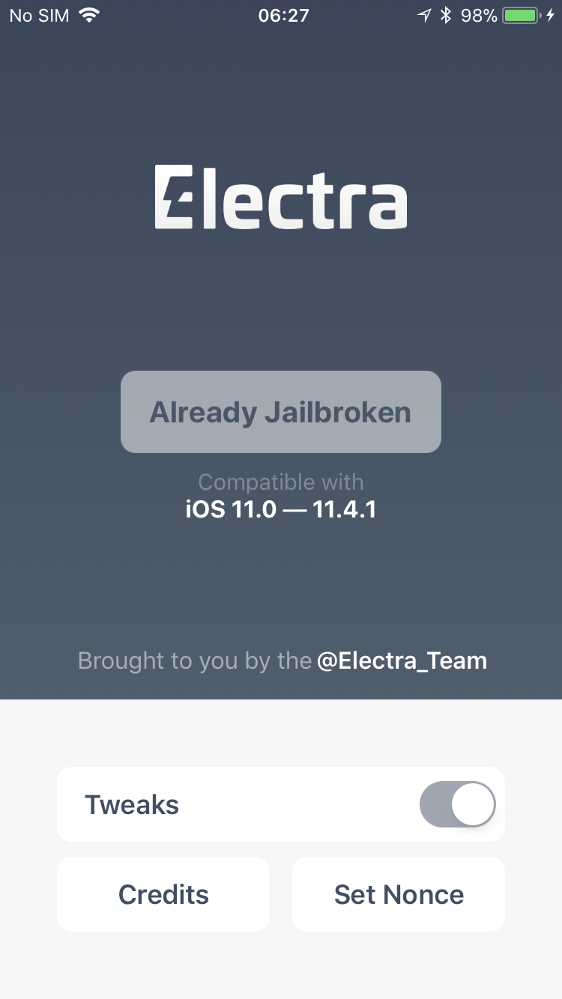

# Set up lldb on Jailbroken device

## Set up

```bash
# macOS - install iProxy
brew install usbmuxd

# for lldb over USB access
iproxy 6666 6666 &

# For SSH over USB access
iproxy 2222 22 &

# SSH onto jailbroken device
ssh -p 2222 root@localhost

# get process ID
ps -ax | grep -i my_app

# invoke lldb
`debugserver localhost:6666 -a my_app` 
```

##### Checkra1n Jailbreak

>An SSH server is deployed on port 44 on localhost only.

```bash
iproxy 4444 44 &
ssh -p 4444 root@localhost
```

##### Electra Jailbreak

Electra shipped with a `debug-server`. Previous jailbreaks had lots of manual steps to get the correct `debug-server` onto the device.


##### Electra app will not open

If you have a full Apple iOS developer license, you can code-sign `ad-hoc` apps to last one year. If the `Electra app` won't open, you can re-code sign the `ipa file`.  One way to achieve this:

- Open `Cydia Impactor`
- Select `\Device\InstallPackage`
- Find the `Electra.ipa` file
- When prompted by `Cydia Impactor` enter your Apple ID.
- Do **NOT** enter your password.  Go to <https://appleid.apple.com/> and generate a `APP-SPECIFIC PASSWORD`

Now `Electra` will work for another year.

##### Electra specifics

When you select `Tweaks`, Electra runs the `debug-server` from a different path:

```bash
# Tweaks enabled
/Developer/usr/bin/debugserver localhost:6666 -a 794

# Tweaks disabled
/usr/bin/debugserver localhost:6666 -a 794
```

##### Hijack the app, before it starts

`/Developer/usr/bin/debugserver localhost:6666 --waitfor my_app`

##### start lldb from Terminal on macOS

```bash
$ lldb
(lldb) process connect connect://localhost:6666
(lldb) thread list
```

##### Terminted due to Code Signing Error

You need to change the `entitlements` inside the app bundle.  Specifically: `<key>get-task-allow</key>`:

```xml
security cms -D -i embedded.mobileprovision | grep -i -A 1 "get"
<key>get-task-allow</key>
	<true/>
```

##### References

```
https://github.com/dmayer/idb/wiki/How-to:-ssh-via-usb
https://kov4l3nko.github.io/blog/2018-05-25-my-experience-with-lldb-and-electra-jb/
```
